# VoteBem System Architecture Diagrams

This document contains comprehensive Mermaid diagrams showing the complete architecture and workflows of the VoteBem Django application.

## 📊 Table of Contents

1. [System Architecture Overview](#system-architecture-overview)
2. [Database Entity Relationship Diagram](#database-entity-relationship-diagram)
3. [User Authentication Flow](#user-authentication-flow)
4. [Voting Process Flow](#voting-process-flow)
5. [Poll Creation and Response Flow](#poll-creation-and-response-flow)
6. [Application URL Structure](#application-url-structure)
7. [Docker Deployment Architecture](#docker-deployment-architecture)
8. [Production Infrastructure](#production-infrastructure)
9. [Development Workflow](#development-workflow)
10. [Social Authentication Flow](#social-authentication-flow)

---

## 1. System Architecture Overview

```mermaid
graph TB
    subgraph "Frontend Layer"
        UI["🌐 Web Interface<br/>Bootstrap 5 + Django Templates"]
        Mobile["📱 Responsive Design<br/>Mobile-First Approach"]
    end
    
    subgraph "Application Layer"
        Django["🐍 Django 4.2.23<br/>Main Application"]
        
        subgraph "Django Apps"
            Voting["🗳️ Voting App<br/>Political Propositions"]
            Polls["📊 Polls App<br/>User Surveys"]
            Users["👤 Users App<br/>Authentication & Profiles"]
        end
        
        subgraph "Authentication"
            DjangoAuth["🔐 Django Auth<br/>Built-in Authentication"]
            Allauth["🔗 Django Allauth<br/>Social Authentication"]
            Google["🔍 Google OAuth"]
            Facebook["📘 Facebook Login"]
        end
    end
    
    subgraph "Data Layer"
        PostgreSQL["🐘 PostgreSQL<br/>Primary Database"]
        Redis["🔴 Redis<br/>Caching & Sessions"]
        StaticFiles["📁 Static Files<br/>CSS, JS, Images"]
        MediaFiles["🖼️ Media Files<br/>User Uploads"]
    end
    
    subgraph "Infrastructure"
        Nginx["⚡ Nginx<br/>Reverse Proxy"]
        Gunicorn["🦄 Gunicorn<br/>WSGI Server"]
        Docker["🐳 Docker<br/>Containerization"]
    end
    
    subgraph "External APIs"
        CamaraAPI["🏛️ Câmara dos Deputados API<br/>Political Data"]
        EmailService["📧 Email Service<br/>Notifications"]
    end
    
    UI --> Django
    Mobile --> Django
    Django --> Voting
    Django --> Polls
    Django --> Users
    
    DjangoAuth --> Users
    Allauth --> Google
    Allauth --> Facebook
    
    Django --> PostgreSQL
    Django --> Redis
    Django --> StaticFiles
    Django --> MediaFiles
    
    Nginx --> Gunicorn
    Gunicorn --> Django
    Docker --> Nginx
    Docker --> PostgreSQL
    Docker --> Redis
    
    Django --> CamaraAPI
    Django --> EmailService
    
    style Django fill:#2E8B57
    style PostgreSQL fill:#336791
    style Redis fill:#DC382D
    style Docker fill:#2496ED
```

---

## 2. Database Entity Relationship Diagram

---

## 3. User Authentication Flow

---

## 4. Voting Process Flow

```mermaid
flowchart TD
    Start(["👤 User Accesses Voting Section"]) --> Auth{"🔐 User Authenticated?"}
    
    Auth -->|No| Login["🔑 Redirect to Login"]
    Login --> Auth
    
    Auth -->|Yes| ListVoting["📋 Display Available Votings<br/>/voting/"]
    
    ListVoting --> SelectVoting["🗳️ User Selects Voting<br/>/voting/votacao/{id}/"]
    
    SelectVoting --> CheckActive{"⏰ Voting Active?"}
    
    CheckActive -->|No| ShowClosed["❌ Show 'Voting Closed' Message"]
    CheckActive -->|Yes| CheckVoted{"✅ Already Voted?"}
    
    CheckVoted -->|Yes| ShowResults["📊 Show Results Only"]
    CheckVoted -->|No| ShowVotingForm["🗳️ Show Voting Form"]
    
    ShowVotingForm --> UserVotes["👆 User Submits Vote<br/>SIM/NÃO/ABSTENÇÃO"]
    
    UserVotes --> ValidateVote{"✔️ Valid Vote?"}
    
    ValidateVote -->|No| ShowError["❌ Show Error Message"]
    ShowError --> ShowVotingForm
    
    ValidateVote -->|Yes| SaveVote["💾 Save Vote to Database"]
    SaveVote --> UpdateProfile["📝 Update User Profile"]
    UpdateProfile --> ShowSuccess["✅ Show Success Message"]
    ShowSuccess --> ShowResults
    
    ShowResults --> ViewStats["📈 View Voting Statistics"]
    ViewStats --> CompareOfficial["🏛️ Compare with Official Results"]
    
    subgraph "Database Operations"
        SaveVote --> CreateVoto["Create Voto Record"]
        CreateVoto --> UpdateCounts["Update Vote Counts"]
        UpdateProfile --> UpdateUserProfile["Update UserProfile.votos_gravados"]
    end
    
    subgraph "Ranking System"
        ViewStats --> UpdateRanking["📊 Update User Ranking"]
        UpdateRanking --> CalculatePoints["🏆 Calculate Participation Points"]
    end
    
    style Start fill:#4CAF50
    style SaveVote fill:#2196F3
    style ShowSuccess fill:#4CAF50
    style ShowError fill:#F44336
```

---

## 5. Poll Creation and Response Flow

```mermaid
flowchart TD
    Start(["👤 User Accesses Polls Section"]) --> Auth{"🔐 User Authenticated?"}
    
    Auth -->|No| Login["🔑 Redirect to Login"]
    Login --> Auth
    
    Auth -->|Yes| PollsHome["📊 Polls Homepage<br/>/polls/"]
    
    PollsHome --> Choice{"🤔 User Choice"}
    
    Choice -->|View Polls| ListPolls["📋 List All Published Polls"]
    Choice -->|Create Poll| CreatePoll["➕ Create New Poll<br/>/polls/criar/"]
    Choice -->|My Polls| MyPolls["👤 My Polls<br/>/polls/minhas/"]
    
    subgraph "Poll Creation Flow"
        CreatePoll --> SelectProposition["🏛️ Select Related Proposition"]
        SelectProposition --> FillForm["📝 Fill Poll Form<br/>Title, Question, Description"]
        FillForm --> ValidateForm{"✔️ Valid Form?"}
        ValidateForm -->|No| ShowFormErrors["❌ Show Form Errors"]
        ShowFormErrors --> FillForm
        ValidateForm -->|Yes| SavePoll["💾 Save Poll as Draft"]
        SavePoll --> PublishChoice{"📢 Publish Now?"}
        PublishChoice -->|Yes| PublishPoll["✅ Set Status to Published"]
        PublishChoice -->|No| SaveDraft["📄 Keep as Draft"]
        PublishPoll --> PollCreated["🎉 Poll Created Successfully"]
        SaveDraft --> PollCreated
    end
    
    subgraph "Poll Response Flow"
        ListPolls --> SelectPoll["👆 Select Poll to View<br/>/polls/{id}/"]
        SelectPoll --> CheckResponded{"✅ Already Responded?"}
        CheckResponded -->|Yes| ShowPollResults["📊 Show Poll Results"]
        CheckResponded -->|No| ShowResponseForm["📝 Show Response Form"]
        ShowResponseForm --> SubmitResponse["👆 Submit Response<br/>SIM/NÃO/NEUTRO + Comment"]
        SubmitResponse --> ValidateResponse{"✔️ Valid Response?"}
        ValidateResponse -->|No| ShowResponseError["❌ Show Error"]
        ShowResponseError --> ShowResponseForm
        ValidateResponse -->|Yes| SaveResponse["💾 Save Response"]
        SaveResponse --> ShowPollResults
    end
    
    subgraph "Poll Management"
        MyPolls --> ManagePolls["⚙️ Manage My Polls"]
        ManagePolls --> EditPoll["✏️ Edit Poll<br/>/polls/{id}/editar/"]
        ManagePolls --> DeletePoll["🗑️ Delete Poll<br/>/polls/{id}/excluir/"]
        ManagePolls --> ViewPollStats["📈 View Poll Statistics"]
    end
    
    ShowPollResults --> ViewComments["💬 View Comments"]
    ViewComments --> SharePoll["🔗 Share Poll"]
    
    style Start fill:#4CAF50
    style SavePoll fill:#2196F3
    style SaveResponse fill:#2196F3
    style PublishPoll fill:#4CAF50
```

---

## 6. Application URL Structure

---

## 7. Docker Deployment Architecture

```mermaid
graph TB
    subgraph "Development Environment"
        DevCompose["🐳 docker-compose.dev.yml"]
        
        subgraph "Development Services"
            DevDjango["🐍 Django Dev Container<br/>Port: 8000<br/>Debug: Enabled<br/>Hot Reload: Yes"]
            DevDB["🐘 PostgreSQL Dev<br/>Port: 5432<br/>Volume: dev_postgres_data"]
            DevRedis["🔴 Redis Dev<br/>Port: 6379<br/>Volume: dev_redis_data"]
        end
        
        DevVolumes["📁 Development Volumes<br/>- Source Code Mount<br/>- Database Data<br/>- Redis Data<br/>- Static Files"]
    end
    
    subgraph "Production Environment"
        ProdCompose["🐳 docker-compose.yml"]
        
        subgraph "Production Services"
            Nginx["⚡ Nginx<br/>Port: 80, 443<br/>SSL Termination<br/>Static Files Serving"]
            ProdDjango["🐍 Django Prod Container<br/>Gunicorn WSGI<br/>Health Checks<br/>Security Hardened"]
            ProdDB["🐘 PostgreSQL Prod<br/>Persistent Volume<br/>Backup Enabled<br/>Performance Tuned"]
            ProdRedis["🔴 Redis Prod<br/>Session Storage<br/>Caching Layer<br/>Persistent Volume"]
        end
        
        ProdVolumes["📁 Production Volumes<br/>- Static Files<br/>- Media Files<br/>- Database Data<br/>- Redis Data<br/>- SSL Certificates<br/>- Backup Data"]
    end
    
    subgraph "Container Images"
        BaseImage["🐍 Python 3.11 Slim"]
        DevImage["🔧 Development Image<br/>+ Debug Tools<br/>+ Jupyter<br/>+ Testing Tools"]
        ProdImage["🚀 Production Image<br/>+ Gunicorn<br/>+ Security Hardening<br/>+ Health Checks"]
    end
    
    subgraph "External Dependencies"
        DockerHub["🐳 Docker Hub<br/>Base Images"]
        PyPI["📦 PyPI<br/>Python Packages"]
        APT["📋 APT Packages<br/>System Dependencies"]
    end
    
    DevCompose --> DevDjango
    DevCompose --> DevDB
    DevCompose --> DevRedis
    DevDjango --> DevVolumes
    
    ProdCompose --> Nginx
    ProdCompose --> ProdDjango
    ProdCompose --> ProdDB
    ProdCompose --> ProdRedis
    Nginx --> ProdDjango
    ProdDjango --> ProdVolumes
    
    BaseImage --> DevImage
    BaseImage --> ProdImage
    DevImage --> DevDjango
    ProdImage --> ProdDjango
    
    DockerHub --> BaseImage
    PyPI --> DevImage
    PyPI --> ProdImage
    APT --> DevImage
    APT --> ProdImage
    
    style DevDjango fill:#4ECDC4
    style ProdDjango fill:#FF6B6B
    style Nginx fill:#96CEB4
    style ProdDB fill:#45B7D1
    style ProdRedis fill:#FFEAA7
```

---

## 8. Production Infrastructure

```mermaid
graph TB
    subgraph "Internet"
        Users["👥 Users"]
        CDN["🌐 CDN (Optional)<br/>Static Assets"]
    end
    
    subgraph "Load Balancer / Reverse Proxy"
        LB["⚖️ Load Balancer<br/>Nginx / Cloudflare"]
    end
    
    subgraph "VPS Server (Linode/DigitalOcean)"
        subgraph "Docker Containers"
            NginxContainer["⚡ Nginx Container<br/>- SSL Termination<br/>- Static File Serving<br/>- Request Routing<br/>- Security Headers"]
            
            subgraph "Application Tier"
                DjangoContainer1["🐍 Django Container 1<br/>- Gunicorn WSGI<br/>- Application Logic<br/>- Health Checks"]
                DjangoContainer2["🐍 Django Container 2<br/>- Auto-scaling<br/>- Load Distribution"]
            end
            
            subgraph "Data Tier"
                PostgreSQLContainer["🐘 PostgreSQL<br/>- Primary Database<br/>- ACID Compliance<br/>- Backup Automation"]
                RedisContainer["🔴 Redis<br/>- Session Storage<br/>- Caching Layer<br/>- Pub/Sub Messaging"]
            end
        end
        
        subgraph "Persistent Storage"
            StaticVolume["📁 Static Files Volume"]
            MediaVolume["🖼️ Media Files Volume"]
            DBVolume["💾 Database Volume"]
            RedisVolume["🗄️ Redis Volume"]
            BackupVolume["💿 Backup Volume"]
            LogsVolume["📋 Logs Volume"]
        end
        
        subgraph "Monitoring & Logging"
            HealthChecks["🏥 Health Checks<br/>- Container Health<br/>- Database Connectivity<br/>- Redis Availability"]
            LogAggregation["📊 Log Aggregation<br/>- Application Logs<br/>- Access Logs<br/>- Error Tracking"]
        end
    end
    
    subgraph "External Services"
        EmailService["📧 Email Service<br/>SendGrid / AWS SES"]
        GoogleOAuth["🔍 Google OAuth<br/>Social Authentication"]
        FacebookOAuth["📘 Facebook OAuth<br/>Social Authentication"]
        CamaraAPI["🏛️ Câmara API<br/>Political Data"]
        SSLProvider["🔒 SSL Provider<br/>Let's Encrypt"]
    end
    
    subgraph "Backup & Recovery"
        AutoBackup["🔄 Automated Backups<br/>- Daily Database Dumps<br/>- File System Snapshots<br/>- Off-site Storage"]
        DisasterRecovery["🚨 Disaster Recovery<br/>- Point-in-time Recovery<br/>- Failover Procedures"]
    end
    
    Users --> CDN
    CDN --> LB
    LB --> NginxContainer
    
    NginxContainer --> DjangoContainer1
    NginxContainer --> DjangoContainer2
    
    DjangoContainer1 --> PostgreSQLContainer
    DjangoContainer1 --> RedisContainer
    DjangoContainer2 --> PostgreSQLContainer
    DjangoContainer2 --> RedisContainer
    
    NginxContainer --> StaticVolume
    DjangoContainer1 --> MediaVolume
    PostgreSQLContainer --> DBVolume
    RedisContainer --> RedisVolume
    
    DjangoContainer1 --> EmailService
    DjangoContainer1 --> GoogleOAuth
    DjangoContainer1 --> FacebookOAuth
    DjangoContainer1 --> CamaraAPI
    
    NginxContainer --> SSLProvider
    
    PostgreSQLContainer --> AutoBackup
    AutoBackup --> BackupVolume
    AutoBackup --> DisasterRecovery
    
    HealthChecks --> LogAggregation
    LogAggregation --> LogsVolume
    
    style Users fill:#4CAF50
    style DjangoContainer1 fill:#FF6B6B
    style DjangoContainer2 fill:#FF6B6B
    style PostgreSQLContainer fill:#336791
    style RedisContainer fill:#DC382D
    style NginxContainer fill:#96CEB4
```

---

## 9. Development Workflow

```mermaid
flowchart TD
    Start(["🚀 Start Development"]) --> Clone["📥 Clone Repository"]
    
    Clone --> Setup["⚙️ Setup Environment<br/>Copy .env.example to .env"]
    
    Setup --> Choice{"🤔 Development Method"}
    
    Choice -->|Docker| DockerSetup["🐳 Docker Development"]
    Choice -->|Local| LocalSetup["💻 Local Development"]
    
    subgraph "Docker Development Flow"
        DockerSetup --> DockerBuild["🔨 make dev-build<br/>Build development containers"]
        DockerBuild --> DockerRun["▶️ make dev<br/>Start development environment"]
        DockerRun --> DockerMigrate["🗃️ make migrate<br/>Run database migrations"]
        DockerMigrate --> DockerSuperuser["👤 make superuser<br/>Create admin user"]
        DockerSuperuser --> DockerDev["💻 Development Ready<br/>http://localhost:8000"]
    end
    
    subgraph "Local Development Flow"
        LocalSetup --> VirtualEnv["🐍 Create Virtual Environment<br/>python -m venv .venv"]
        VirtualEnv --> ActivateEnv["⚡ Activate Environment<br/>.venv\Scripts\activate"]
        ActivateEnv --> InstallDeps["📦 Install Dependencies<br/>pip install -r requirements.txt"]
        InstallDeps --> LocalMigrate["🗃️ Run Migrations<br/>python manage.py migrate"]
        LocalMigrate --> LocalSuperuser["👤 Create Superuser<br/>python manage.py createsuperuser"]
        LocalSuperuser --> LocalRun["▶️ Run Server<br/>python manage.py runserver"]
        LocalRun --> LocalDev["💻 Development Ready<br/>http://localhost:8000"]
    end
    
    DockerDev --> DevWork["👨‍💻 Development Work"]
    LocalDev --> DevWork
    
    subgraph "Development Cycle"
        DevWork --> CodeChange["✏️ Make Code Changes"]
        CodeChange --> TestLocal["🧪 Test Locally"]
        TestLocal --> TestPassed{"✅ Tests Pass?"}
        TestPassed -->|No| FixIssues["🔧 Fix Issues"]
        FixIssues --> CodeChange
        TestPassed -->|Yes| Commit["📝 Git Commit"]
        Commit --> Push["📤 Git Push"]
    end
    
    Push --> Review["👀 Code Review"]
    Review --> Merge["🔀 Merge to Main"]
    
    subgraph "Deployment Pipeline"
        Merge --> BuildProd["🏗️ Build Production<br/>make prod-build"]
        BuildProd --> TestProd["🧪 Test Production Build"]
        TestProd --> Deploy["🚀 Deploy to Production<br/>./scripts/deploy_production.sh"]
    end
    
    Deploy --> Monitor["📊 Monitor Application"]
    Monitor --> Feedback["📋 Gather Feedback"]
    Feedback --> DevWork
    
    subgraph "Quality Assurance"
        TestLocal --> RunTests["🧪 make test<br/>Run test suite"]
        RunTests --> Coverage["📊 make coverage<br/>Check code coverage"]
        Coverage --> Lint["🔍 make lint<br/>Code linting"]
        Lint --> Format["🎨 make format<br/>Code formatting"]
    end
    
    style Start fill:#4CAF50
    style DevWork fill:#2196F3
    style Deploy fill:#FF6B6B
    style TestPassed fill:#4CAF50
```

---

## 10. Social Authentication Flow

---

## 📝 Diagram Usage Notes

### Viewing the Diagrams
These Mermaid diagrams can be viewed in:
- **GitHub**: Automatically rendered in markdown files
- **VS Code**: With Mermaid preview extensions
- **Mermaid Live Editor**: https://mermaid.live/
- **Documentation sites**: GitBook, Notion, etc.

### Updating the Diagrams
When the application architecture changes:
1. Update the relevant diagrams in this file
2. Ensure consistency across all diagrams
3. Test diagram rendering before committing
4. Update the table of contents if adding new diagrams

### Diagram Maintenance
- **Database ERD**: Update when models change
- **User Flows**: Update when adding new features
- **Infrastructure**: Update when deployment changes
- **URL Structure**: Update when adding new endpoints

These diagrams serve as living documentation and should be kept up-to-date with the actual implementation.