# VoteBem Documentation Index

Welcome to the comprehensive documentation for the VoteBem Django application - a web system that enables citizens to participate in popular votes on legislative propositions and create polls on public interest topics.

## 📚 Documentation Overview

This documentation is organized to guide you through every aspect of the VoteBem application, from initial setup to production deployment and maintenance.

---

## 🚀 Getting Started

### [OVERVIEW.md](./OVERVIEW.md)
**Main project overview and feature documentation**
- **Use Case**: Start here to understand what VoteBem does and its core features
- **Contains**: Project description, feature list, technology stack, and basic usage instructions
- **When to Use**: First-time users, project overview, understanding system capabilities

### [WINDOWS_DEV_SETUP.md](./WINDOWS_DEV_SETUP.md)
**Windows 11 development environment setup**
- **Use Case**: Setting up a local development environment on Windows
- **Contains**: Step-by-step Windows setup, automated scripts, manual configuration
- **When to Use**: Developers setting up local development on Windows machines

### [DEV_QUICK_START.md](./DEV_QUICK_START.md)
**Quick development environment setup guide**
- **Use Case**: Fast setup for developers who want to get started quickly
- **Contains**: Streamlined setup instructions, essential commands, rapid deployment
- **When to Use**: Quick prototyping, fast development setup, minimal configuration

---

## 🐳 Docker & Deployment

### [DOCKER_README.md](./DOCKER_README.md)
**Comprehensive Docker deployment guide**
- **Use Case**: Containerized deployment for both development and production
- **Contains**: Docker configuration, compose files, environment setup, VPS deployment
- **When to Use**: Deploying with Docker, containerized environments, production setup

### [DEPLOYMENT_GUIDE.md](./DEPLOYMENT_GUIDE.md)
**Complete production deployment instructions**
- **Use Case**: Production deployment on VPS with detailed configuration
- **Contains**: SSH setup, Git configuration, Docker deployment, troubleshooting
- **When to Use**: Production deployments, VPS configuration, deployment troubleshooting

### [ENVIRONMENTS.md](./ENVIRONMENTS.md)
**Docker Compose environments and configurations**
- **Use Case**: Understanding different deployment environments and their configurations
- **Contains**: Production, development, and services-only Docker setups, environment comparison
- **When to Use**: Choosing deployment strategy, environment configuration, Docker setup

---

## 🔧 Scripts & Automation

### [SCRIPTS_README.md](./SCRIPTS_README.md)
**Overview of deployment and management scripts**
- **Use Case**: Understanding available automation scripts
- **Contains**: Script descriptions, usage instructions, deployment workflows
- **When to Use**: Automated deployments, script selection, workflow understanding

### [SCRIPTS_DETAILED_README.md](./SCRIPTS_DETAILED_README.md)
**Detailed VPS setup and provisioning scripts**
- **Use Case**: VPS provisioning and application-specific configuration
- **Contains**: Two-phase setup process, security configuration, application deployment
- **When to Use**: New VPS setup, security hardening, automated provisioning

### Scripts Overview
- Windows development scripts: `.bat` in `scripts/` — `setup.bat`, `startup.bat`, `startup_dev.bat`, `stop.bat`, `troubleshoot.bat`.
- Linux production scripts: `.sh` in `scripts/` — `provision_vps.sh`, `setup_votebem.sh`, `deploy_production.sh`, `setup_ssl.sh`, plus `common_functions.sh`.
- Quick workflows:
  - Development: setup → startup/startup_dev → stop → troubleshoot.
  - Production: provision → setup_votebem → setup_ssl → deploy_production.
- Environment variables: see `SCRIPTS_README.md` for Linux script variables; Windows scripts auto-handle local env.
- Where to start: use `WINDOWS_DEV_SETUP.md` for dev; use `SCRIPTS_DETAILED_README.md` (provision) then `SCRIPTS_README.md` (deploy) for production.

```mermaid
graph TD
    A[🚀 Start: Fresh VPS] --> B[📋 Prerequisites Check]
    B --> C{VPS Provider?}
    
    C -->|Linode| D[🔧 Linode VPS Setup]
    C -->|Other| E[🔧 Generic VPS Setup]
    
    D --> F[🔐 Initial Security Setup]
    E --> F
    
    F --> G[📦 Install Base Dependencies]
    G --> H[🐳 Install Docker & Docker Compose]
    H --> I[🔑 Configure SSH Keys]
    I --> J[🛡️ Setup Firewall Rules]
    J --> K[👤 Create Non-root User]
    
    K --> L[📥 Clone VoteBem Repository]
    L --> M[⚙️ Environment Configuration]
    M --> N[🔐 Generate Secure Secrets]
    N --> O[🌐 Configure Domain/IP]
    
    O --> P{Deployment Type?}
    
    P -->|HTTP Only| Q[🔧 HTTP Configuration]
    P -->|HTTPS/SSL| R[🔒 SSL Certificate Setup]
    
    Q --> S[🐳 Docker Compose Build]
    R --> T[🔒 Let's Encrypt Setup]
    T --> S
    
    S --> U[🗄️ Database Migration]
    U --> V[👑 Create Superuser]
    V --> W[📊 Collect Static Files]
    W --> X[🌐 Configure Nginx]
    
    X --> Y[🚀 Start Services]
    Y --> Z[✅ Health Check]
    Z --> AA{All Services OK?}
    
    AA -->|No| AB[🔍 Troubleshoot Issues]
    AB --> AC[📋 Check Logs]
    AC --> AD[🔧 Fix Configuration]
    AD --> Y
    
    AA -->|Yes| AE[🎉 Deployment Complete]
    AE --> AF[🔗 Access Application]
    AF --> AG[👤 Setup Social Auth]
    AG --> AH[📝 Configure Polls/Voting]
    AH --> AI[🎯 Production Ready]

    %% Styling
    classDef startEnd fill:#e1f5fe,stroke:#01579b,stroke-width:2px,color:#000000
    classDef process fill:#f3e5f5,stroke:#4a148c,stroke-width:2px,color:#000000
    classDef decision fill:#fff3e0,stroke:#e65100,stroke-width:2px,color:#000000
    classDef security fill:#e8f5e8,stroke:#1b5e20,stroke-width:2px,color:#000000
    classDef docker fill:#e3f2fd,stroke:#0d47a1,stroke-width:2px,color:#000000
    classDef config fill:#fce4ec,stroke:#880e4f,stroke-width:2px,color:#000000
    classDef success fill:#e8f5e8,stroke:#2e7d32,stroke-width:3px,color:#000000
    
    class A,AI startEnd
    class B,G,H,L,M,S,U,V,W,X,Y,AB,AC,AD process
    class C,P,AA decision
    class F,I,J,K,N,T security
    class D,E,Q,R docker
    class O,Z,AE,AF,AG,AH config
    class AI success
```

### 📋 Setup Phase Descriptions

1. **💻 Local Development Setup** ([WINDOWS_DEV_SETUP.md](./WINDOWS_DEV_SETUP.md))
   - Windows 11 development environment configuration
   - Python virtual environment and dependencies
- Docker services for MariaDB and Redis
- DBeaver and Adminer database management setup

2. **🚀 VPS Provisioning** ([SCRIPTS_DETAILED_README.md](./SCRIPTS_DETAILED_README.md))
   - Choose VPS provider (Linode recommended)
   - Basic server setup and security hardening
   - User account creation and SSH configuration
   - VPS-specific provisioning scripts (`provision_vps.sh`, `setup_votebem.sh`)

3. **🔧 Production Deployment** ([SCRIPTS_README.md](./SCRIPTS_README.md))
   - Production deployment automation scripts
   - Application deployment with `deploy_production.sh`
   - Container management and troubleshooting
   - Environment variable generation and security

4. **🐳 Docker Configuration** ([DOCKER_README.md](./DOCKER_README.md))
   - Docker Compose configuration for all environments
   - Container orchestration and networking
   - Database setup and migrations
   - Static file collection and Nginx configuration

5. **🔒 Security & SSL** ([DEPLOYMENT_GUIDE.md](./DEPLOYMENT_GUIDE.md) + [SCRIPTS_README.md](./SCRIPTS_README.md))
   - SSL certificate generation with Let's Encrypt
   - HTTPS configuration and automatic renewal
   - Security best practices implementation
   - Firewall and access control setup

6. **👤 User Authentication** ([SOCIAL_AUTH_GUIDE.md](./SOCIAL_AUTH_GUIDE.md))
   - Social authentication setup (Google, Facebook)
   - OAuth provider configuration
   - User account management and linking

7. **🏗️ System Architecture** ([ARCHITECTURE_DIAGRAMS.md](./ARCHITECTURE_DIAGRAMS.md))
   - Understanding system components and relationships
   - Database ERD and application workflows
   - Deployment architecture visualization

---

## 📖 How to Use This Documentation

### For New Developers
1. Start with [OVERVIEW.md](./OVERVIEW.md) to understand the project
2. Use [DEV_QUICK_START.md](./DEV_QUICK_START.md) for rapid setup or [WINDOWS_DEV_SETUP.md](./WINDOWS_DEV_SETUP.md) for detailed Windows setup
3. Review [ARCHITECTURE_DIAGRAMS.md](./ARCHITECTURE_DIAGRAMS.md) for system understanding
4. Use [DOCKER_README.md](./DOCKER_README.md) for containerized development setup

### For DevOps/Deployment
1. Begin with [DEPLOYMENT_GUIDE.md](./DEPLOYMENT_GUIDE.md) for overview
2. Review [ENVIRONMENTS.md](./ENVIRONMENTS.md) to understand Docker configurations
3. Use [SCRIPTS_DETAILED_README.md](./SCRIPTS_DETAILED_README.md) for VPS setup
4. Follow [DOCKER_README.md](./DOCKER_README.md) for containerized deployment
5. Reference [SCRIPTS_README.md](./SCRIPTS_README.md) for automation

### For Feature Development
1. Review [ARCHITECTURE_DIAGRAMS.md](./ARCHITECTURE_DIAGRAMS.md) for system design
2. Check [SOCIAL_AUTH_GUIDE.md](./SOCIAL_AUTH_GUIDE.md) for authentication features
3. Use [OVERVIEW.md](./OVERVIEW.md) for feature specifications

### For Troubleshooting
1. Check [DEPLOYMENT_GUIDE.md](./DEPLOYMENT_GUIDE.md) for common issues
2. Review [DOCKER_README.md](./DOCKER_README.md) for container problems
3. Use [SCRIPTS_README.md](./SCRIPTS_README.md) for script-related issues

---

## 🔄 Documentation Maintenance

This documentation is actively maintained and updated with each release. If you find any issues or have suggestions for improvement, please:

1. Check the relevant documentation file for the most current information
2. Review the UML diagram above for the complete setup workflow
3. Consult multiple related documents for comprehensive understanding
4. Report issues or contribute improvements to the documentation

---

**Last Updated**: January 2025  
**VoteBem Version**: Latest  
**Documentation Version**: 1.0